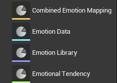
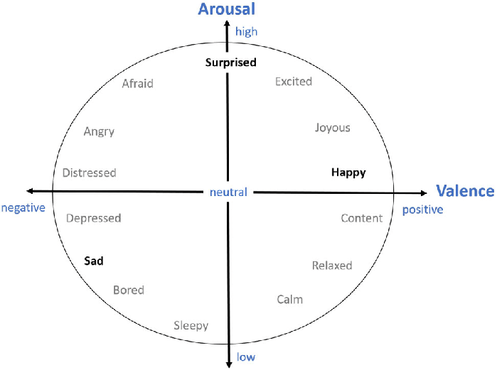
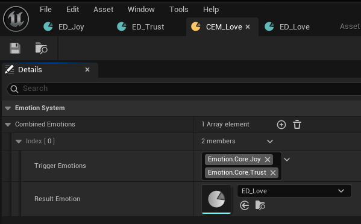
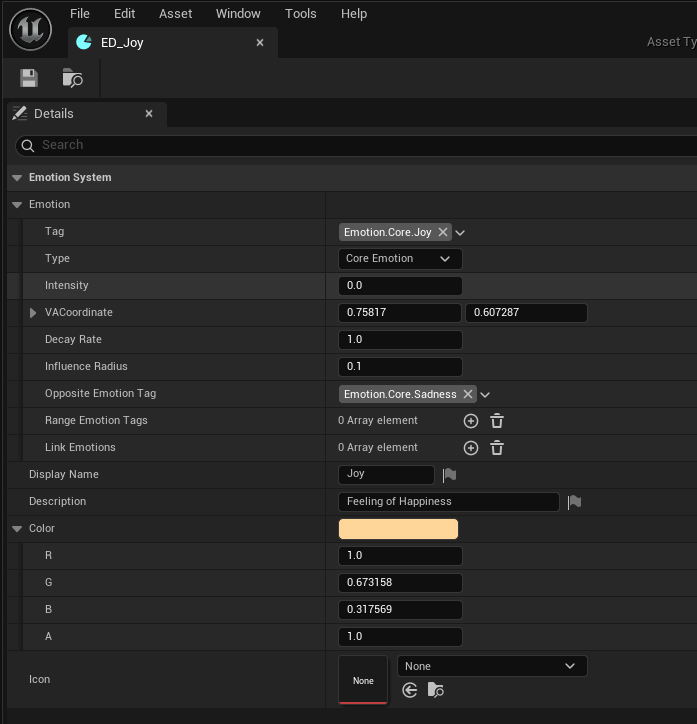
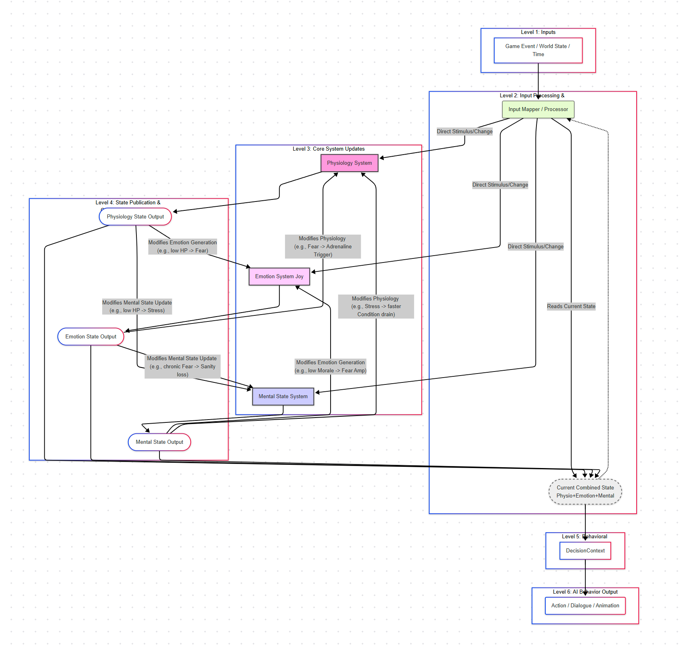
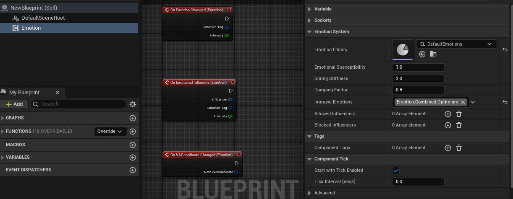
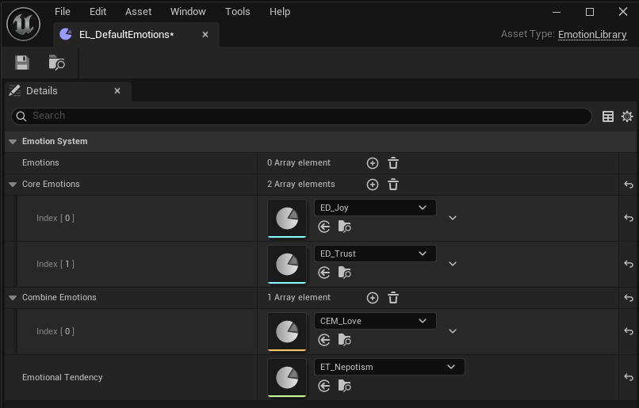
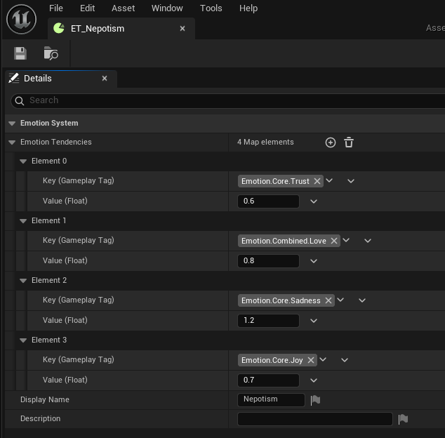

# Emotion Engine

A powerful Unreal Engine 5.5 plugin that brings emotional intelligence to your game characters, creating more engaging and immersive experiences.



## Vision & Goals

The Emotion Engine aims to revolutionize character behavior in games by implementing a psychologically-grounded emotional system. Our goals are:

1. **Create More Believable Characters**: Enable NPCs to respond emotionally to game events, conversations, and environments.
2. **Enhance Player Immersion**: Build deeper connections between players and virtual characters through realistic emotional responses.
3. **Simplify Complex Psychology**: Make sophisticated emotional modeling accessible to game developers without requiring expertise in psychology.
4. **Support Narrative Design**: Give writers and narrative designers powerful tools to craft emotionally resonant stories.
5. **Enable Emergent Gameplay**: Allow for unexpected character behaviors driven by emotional states rather than scripted responses.


## Design Philosophy

The Emotion Engine is built on several key design principles:

### 1. Psychological Foundation

Inspired by Robert Plutchik's Wheel of Emotions, the system models how emotions relate to each other, blend together, and vary in intensity. This creates a rich emotional landscape that feels authentic to players.

### 2. Valence-Arousal Model

Emotions exist in a 2D space where:
- **Valence**: Represents how positive or negative an emotion feels (horizontal axis)
- **Arousal**: Represents the energy level or intensity of the emotion (vertical axis)

This allows for natural transitions between emotional states and nuanced emotional responses.



### 3. Dynamic Emotional Physics

The system uses a "spring model" where:
- Characters have a current emotional state (VA coordinate)
- Active emotions pull this state toward them with force proportional to distance
- Emotions naturally decay over time unless reinforced
- Emotional states can trigger secondary linked emotions when thresholds are reached

### 4. Emotion Combinations

Just as in real life, emotions can blend together to create complex feelings. For example:
- Joy + Trust might create Love
- Fear + Surprise might create Awe
- Sadness + Disgust might create Remorse

This allows for a wide spectrum of emotional responses from a relatively small set of core emotions.



## Practical Applications

### Character Behavior

- **NPCs with Memory**: Characters remember emotional events and hold grudges or develop affection
- **Contextual Dialogue**: Dialogue systems that adapt based on a character's current emotional state
- **Dynamic Relationships**: Character relationships that evolve naturally based on emotional interactions
- **Emotional Contagion**: Emotions that spread between characters in proximity (panic in crowds, etc.)

### Gameplay Mechanics

- **Persuasion Systems**: Success depends on understanding and manipulating NPC emotions
- **Stealth Mechanics**: Guards become more alert when afraid or suspicious
- **Loyalty Systems**: Companions whose loyalty depends on emotional connection
- **Decision Consequences**: Player choices that have emotional impacts on the game world

### Environmental Design

- **Emotional Zones**: Areas that influence character emotions (calming garden, tense battlefield)
- **Adaptive Music**: Soundtracks that respond to the emotional state of characters or scenes
- **Visual Effects**: Environmental effects that reflect or influence emotional states

## Core System Components

### Emotion Component

The heart of the system is the Emotion Component, which can be attached to any actor to give it emotional capabilities:

- Maintains a current Valence-Arousal coordinate representing emotional state
- Holds an array of active emotions affecting the character
- Automatically manages emotion decay and influence over time
- Provides events for gameplay responses to emotional changes

### Emotions

Each emotion is defined by several key properties:

- **Intensity**: Ranges from 1-100, determining the strength of the emotion
- **Decay Rate**: How quickly the emotion fades over time
- **Influence Radius**: How far the emotion can affect other emotions
- **VA Coordinate**: Where this emotion sits in the valence-arousal space




### Emotional Stimuli

Anything in the game world can trigger emotions:

- Dialogue choices
- Game events
- Environmental objects
- Other characters
- Player actions


## Integration with Other Systems



## Getting Started

### Installation

1. Clone or copy the plugin to your project's `Plugins` directory
2. Enable the plugin through the Unreal Editor's Plugins menu
3. Add "EmotionEngine" to your project's dependencies in the build.cs file

### Quick Start Guide

#### 1. Add Emotion Component to Your Character

In your character blueprint:
- Add the Emotion Component
- Optionally assign a custom Emotion Library asset (or use the default)







#### 2. Trigger Emotions

There are multiple ways to trigger emotions:

- **Direct API Calls**:
  ```
  // In Blueprint
  EmotionComponent->AddEmotion(JoyEmotion, 75.0f);
  
  // Or in C++
  YourCharacter->GetEmotionComponent()->AddEmotion(JoyEmotion, 75.0f);
  ```

- **Environmental Triggers**:
  Create objects with the Emotion Influencer component that affect nearby characters

- **Event Responses**:
  Set up your game events to trigger appropriate emotional responses

#### 3. React to Emotional States

Listen for emotion events in your character logic:

- **On Emotion Added**: When a new emotion is experienced
- **On Emotion Threshold Reached**: When an emotion reaches a certain intensity
- **On VA Coordinate Changed**: When the overall emotional state shifts

#### 4. Create Emotional Behaviors

Use the current emotional state to drive:
- Animation selections
- Dialogue choices
- AI decision making
- Visual effects

### Example: Creating a Scared Guard

1. Add Emotion Component to your guard character
2. When player makes loud noise, call `AddEmotion(FearEmotion, 60.0f)`
3. In the guard's behavior tree, check if Fear > 50
4. If true, switch to "Alert" behavior state
5. As Fear naturally decays, guard returns to normal patrol

## Design Benefits

### For Game Designers

- **Emergent Behavior**: Characters respond naturally to situations without explicit scripting
- **Emotional Storytelling**: Create more nuanced narrative arcs driven by emotional states
- **Simplified Complexity**: Complex psychological concepts made accessible through intuitive tools
- **Reusable Systems**: The same emotion system can drive different game mechanics across your project

### For Programmers

- **Clean Architecture**: Clear separation of responsibilities between components
- **Optimized Performance**: Efficient implementation with minimal overhead
- **Blueprint Friendly**: Full access to emotion systems from both C++ and Blueprints
- **Extensible Design**: Easy to add new emotions or emotional responses

### For Artists

- **Emotional Reactivity**: Characters that visually respond to their emotional states
- **Dynamic Environments**: Create spaces that influence and respond to emotional states
- **Expressive Animation**: Drive animation selection based on emotional context

---

**Note:** The Emotion Engine is designed to be a foundational system that you can build upon. While it provides the core emotional simulation, the most powerful applications come from integrating it with your game's unique systems and mechanics.
