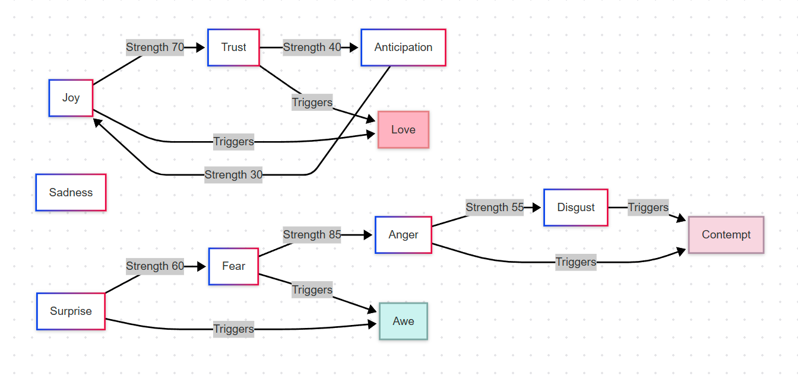

# Emotion Engine

An Unreal Engine plugin that provides a robust, data-driven emotion system based on Plutchik's Wheel of Emotions for AI characters and gameplay mechanics.

## Overview

The Emotion Engine plugin implements a flexible emotion system inspired by the psychological model of Plutchik's Wheel of Emotions. This plugin provides a framework for creating emotionally nuanced AI characters, NPCs, or any gameplay elements that can benefit from dynamic emotional states. The system is designed to be data-driven, using `UEmotionData` assets to define emotions and their relationships (opposites, intensity ranges, linked variations). The runtime state is managed by the `UEmotionState` class.

## Features

- Implementation inspired by Plutchik's Wheel of Emotions using Unreal Engine's GameplayTag system.
- Support for core emotions (e.g., Joy, Trust, Fear, Surprise, Sadness, Disgust, Anger, Anticipation) defined via Gameplay Tags.
- **Data-Driven Design:** Define emotions, their opposites, intensity ranges, and linked variations using `UEmotionData` assets collected within a `UEmotionLibrary`.
- **Intensity Variations & Linked Emotions:** Automatically derive secondary emotion tags (e.g., high/low intensity ranges, nuanced variations) based on core emotion intensity and the rules defined in `UEmotionData`.
- **`UEmotionState`:** Manages the current emotional state of an entity, holding core emotion intensities and the derived gameplay tags.
- **Core Components (Potentially require updates based on core changes):**
    - `EmotionComponent`: For attaching emotional capabilities to actors. (Note: API might change based on `UEmotionState` integration).
    - `EmotionSubsystem`: For tracking and querying emotional entities globally. (Note: API might change).
    - `EmotionInteractionInterface`: For objects to affect the emotions of others.
    - `EmotionInfluencer`: Base class for creating emotion-affecting objects.
- Event-based notification system for emotion changes (likely via `UEmotionState` or `EmotionComponent`).
- Blueprint-friendly API (primarily through `UEmotionState` and potentially `EmotionComponent`).
- Easy integration with AI behavior trees and other systems.

## Installation

1.  Clone or copy the plugin to your project's `Plugins` directory.
2.  Enable the plugin in your project through the Plugins menu in the Unreal Editor.
3.  Add "EmotionEngine" to your project's dependencies in the `build.cs` file:

```csharp
PublicDependencyModuleNames.AddRange(
    new string[]
    {
        "Core",
        "CoreUObject",
        "Engine",
        "GameplayTags", // Add GameplayTags
        "EmotionEngine",
        // ... other dependencies
    }
);
```

## Plutchik's Wheel Inspiration

Robert Plutchik's psychoevolutionary theory of emotion proposes eight primary emotions arranged in opposing pairs:

-   Joy vs. Sadness
-   Trust vs. Disgust
-   Fear vs. Anger
-   Surprise vs. Anticipation

The model also accounts for variations in intensity. This plugin leverages this concept by allowing the definition of different emotion tags triggered at various intensity levels for each core emotion, configured within `UEmotionData`.

## Diagram





# How it might work with other system


## Usage

### Defining Emotions (`UEmotionData` / `UEmotionLibrary`)

1.  **Create `UEmotionData` Assets:** For each emotion (core, range, variation), create a `UEmotionData` asset.
2.  **Configure `FEmotion`:** Inside each `UEmotionData` asset, configure the `FEmotion` struct:
    *   `Tag`: The primary Gameplay Tag for this emotion (e.g., `Emotion.Core.Joy`).
    *   `OppositeEmotionTag`: The tag of the opposing emotion (e.g., `Emotion.Core.Sadness`).
    *   `RangeEmotionTags`: Define `FEmotionTriggerRange` entries to specify which `Emotion.Range.*` tags are activated based on the *intensity* of the core emotion.
    *   `LinkEmotions`: Define `FEmotionLink` entries to specify how this emotion links to `Emotion.Variation.*` tags, potentially based on intensity thresholds and further ranges.
3.  **Create `UEmotionLibrary` Asset:** Create a `UEmotionLibrary` asset to hold references to all your `UEmotionData` assets. Assign core emotions to the `CoreEmotions` array.

### Managing Runtime State (`UEmotionState`)

The `UEmotionState` class is responsible for tracking the active emotions and their intensities for an entity at runtime.

1.  **Initialization:** Obtain or create a `UEmotionState` object and initialize it with your `UEmotionLibrary` instance:
    ```cpp
    #include "EmotionState.h"
    #include "EmotionData.h" // For UEmotionLibrary

    UEmotionState* EmotionState = NewObject<UEmotionState>(Owner); // Or get from EmotionComponent
    UEmotionLibrary* MyEmotionLibrary = LoadObject<UEmotionLibrary>(nullptr, TEXT("/Path/To/Your/EmotionLibrary.EmotionLibrary"));
    if (EmotionState && MyEmotionLibrary)
    {
        EmotionState->Initialize(MyEmotionLibrary);
    }
    ```
2.  **Modifying Core Emotions:** Use functions like `AddCoreEmotionTag`, `RemoveCoreEmotionTag`, and `SetIntensity` on the `UEmotionState` instance. These functions automatically trigger updates to the derived range and linked emotion tags based on the definitions in the `UEmotionLibrary`.
    ```cpp
    #include "EmotionTags.h" // For emotion tags

    // Assuming EmotionState is valid and initialized
    EmotionState->AddCoreEmotionTag(EmotionGameplayTags::Emotion_Joy, 0.7f); // Adds Joy, potentially triggers range/linked tags
    EmotionState->SetIntensity(EmotionGameplayTags::Emotion_Joy, 0.9f);      // Updates Joy intensity, re-evaluates range/linked tags
    EmotionState->RemoveCoreEmotionTag(EmotionGameplayTags::Emotion_Joy);    // Removes Joy, clears related derived tags
    ```
3.  **Querying State:**
    *   Check for active tags in `EmotionState->EmotionTags`.
    *   Get the intensity of any tag (core, range, or linked) using `EmotionState->GetIntensity(Tag)`. Note that derived tags usually inherit the absolute intensity of their parent core emotion.

### Using `EmotionComponent` (Conceptual - API May Vary)

The `EmotionComponent` likely serves as a wrapper around `UEmotionState`, attaching it to an Actor.

1.  Add the `UEmotionComponent` to your Actor.
2.  Configure the component, potentially assigning the `UEmotionLibrary` to use.
3.  Access the underlying `UEmotionState` via the component (e.g., `EmotionComponent->GetEmotionState()`) to modify or query emotions as described above.
4.  Listen for events broadcast by the component or the state object when emotions change.

### Using `EmotionSubsystem` (Conceptual - API May Vary)

The `EmotionSubsystem` likely tracks all active `EmotionComponent` instances.

1.  Get the subsystem from the World.
2.  Use its functions to find components based on the *current* emotion tags present in their `UEmotionState` (e.g., find all actors currently feeling `Emotion.Range.High.Joy.Ecstasy`).

### Using `EmotionInteractionInterface` / `EmotionInfluencer` (Conceptual - API May Vary)

These likely provide mechanisms for actors to affect the `UEmotionState` of other actors, potentially by directly calling functions on the target's `UEmotionState` or `EmotionComponent`.

## Emotion Tags (`EmotionTags.h/.cpp`)

Core emotion tags are defined under `Emotion.Core.*`. Intensity-based range emotions are typically under `Emotion.Range.*`, and linked/variation emotions under `Emotion.Variation.*`. Refer to `EmotionTags.h` for specific tag definitions.

```cpp
#include "EmotionTags.h"

FGameplayTag JoyTag = EmotionGameplayTags::Emotion_Joy;
FGameplayTag EcstasyTag = EmotionGameplayTags::Emotion_Range_High_Joy_Ecstasy; // Example Range Tag
FGameplayTag HopefulTag = EmotionGameplayTags::Emotion_Variation_Joy_Peaceful_Hopeful; // Example Variation Tag
```

---

**Note:** The specific APIs for `EmotionComponent`, `EmotionSubsystem`, `EmotionInteractionInterface`, and `EmotionInfluencer` may need further updates to fully align with the refactored `UEmotionState` and data-driven approach. The examples provided for these components are conceptual based on their likely purpose.
