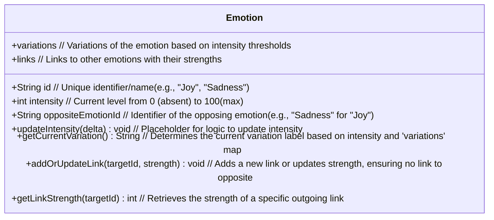
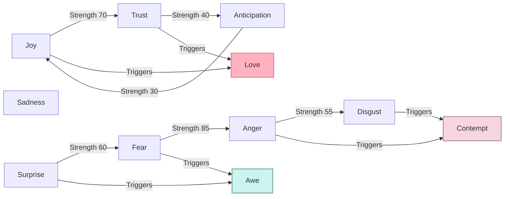
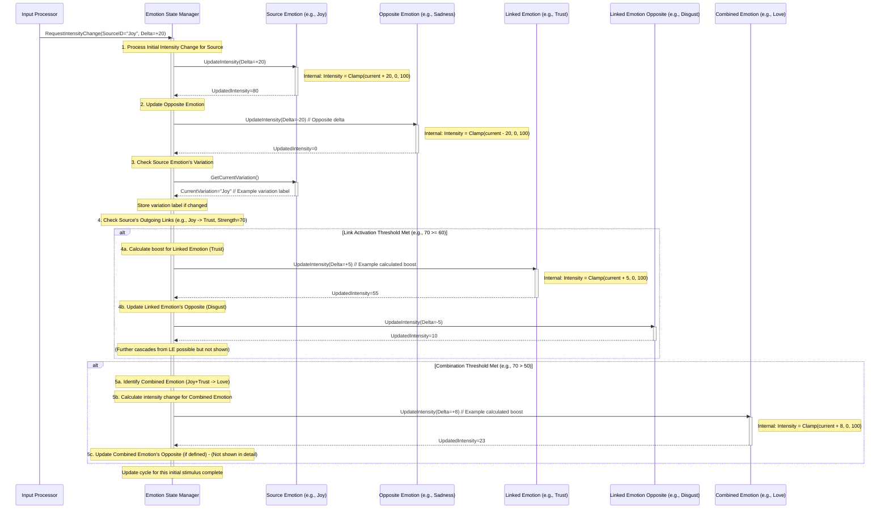

```mermaid
classDiagram
  %% Representing the structure of a single Emotion entity in the AI system
  class Emotion {
    +String id  // Unique identifier/name (e.g., "Joy", "Sadness")
    +int intensity  // Current level from 0 (absent) to 100 (max)
    +String oppositeEmotionId // Identifier of the opposing emotion (e.g., "Sadness" for "Joy")
    +variations  // Variations of the emotion based on intensity thresholds
    +links  // Links to other emotions with their strengths

    %% Optional methods representing potential operations on the emotion data
    +updateIntensity(delta) void // Placeholder for logic to update intensity
    +getCurrentVariation() String // Determines the current variation label based on intensity and 'variations' map
    +addOrUpdateLink(targetId, strength) void // Adds a new link or updates strength, ensuring no link to opposite
    +getLinkStrength(targetId) int // Retrieves the strength of a specific outgoing link
  }
```

```mermaid
%% Emotional relationships diagram
graph LR
    %% === Nodes representing Emotions ===
    Joy[Joy]
    Sadness[Sadness]
    Anger[Anger]
    Fear[Fear]
    Trust[Trust]
    Disgust[Disgust]
    Surprise[Surprise]
    Anticipation[Anticipation]

    %% === Nodes for Combined Emotions (triggered by strong links) ===
    Love[Love]
    Awe[Awe]
    Contempt[Contempt]

    %% === Define Links & Strengths (Examples) ===
    %% Link Strength > 50 (potential combination trigger)
    Joy -- Strength 70 --> Trust
    Fear -- Strength 85 --> Anger
    Surprise -- Strength 60 --> Fear
    Anger -- Strength 55 --> Disgust

    %% Link Strength <= 50 (no combination trigger)
    Trust -- Strength 40 --> Anticipation
    Anticipation -- Strength 30 --> Joy

    %% === Show Triggering of Combined Emotions ===
    %% Based on Link Strength > 50 threshold from the examples above
    Joy -- Triggers --> Love
    Trust -- Triggers --> Love
    Surprise -- Triggers --> Awe
    Fear -- Triggers --> Awe
    Anger -- Triggers --> Contempt
    Disgust -- Triggers --> Contempt

    %% === Style Combined Emotion Nodes ===
    style Love fill:#ffb3c1,stroke:#e67f83,stroke-width:2px
    style Awe fill:#cbf3f0,stroke:#7ca9a4,stroke-width:2px
    style Contempt fill:#f7d6e0,stroke:#b08ea2,stroke-width:2px

    %% === Indicate Opposites (by not linking them) ===
    %% Implicit: No arrow between Joy <-> Sadness
    %% Implicit: No arrow between Anger <-> Fear
    %% Implicit: No arrow between Trust <-> Disgust
    %% Implicit: No arrow between Surprise <-> Anticipation

```

```mermaid
sequenceDiagram
    participant IP as Input Processor
    participant ESM as Emotion State Manager
    participant SE as Source Emotion (e.g., Joy)
    participant OE as Opposite Emotion (e.g., Sadness)
    participant LE as Linked Emotion (e.g., Trust)
    participant LEO as Linked Emotion Opposite (e.g., Disgust)
    participant CE as Combined Emotion (e.g., Love)

    IP->>ESM: RequestIntensityChange(SourceID="Joy", Delta=+20)
    activate ESM

    note over ESM: 1. Process Initial Intensity Change for Source
    ESM->>SE: UpdateIntensity(Delta=+20)
    activate SE
    note right of SE: Internal: Intensity = Clamp(current + 20, 0, 100)
    SE-->>ESM: UpdatedIntensity=80
    deactivate SE

    note over ESM: 2. Update Opposite Emotion
    ESM->>OE: UpdateIntensity(Delta=-20) // Opposite delta
    activate OE
    note right of OE: Internal: Intensity = Clamp(current - 20, 0, 100)
    OE-->>ESM: UpdatedIntensity=0
    deactivate OE

    note over ESM: 3. Check Source Emotion's Variation
    ESM->>SE: GetCurrentVariation()
    activate SE
    SE-->>ESM: CurrentVariation="Joy" // Example variation label
    deactivate SE
    note over ESM: Store variation label if changed

    note over ESM: 4. Check Source's Outgoing Links (e.g., Joy -> Trust, Strength=70)
    alt Link Activation Threshold Met (e.g., 70 >= 60)
        note over ESM: 4a. Calculate boost for Linked Emotion (Trust)
        ESM->>LE: UpdateIntensity(Delta=+5) // Example calculated boost
        activate LE
        note right of LE: Internal: Intensity = Clamp(current + 5, 0, 100)
        LE-->>ESM: UpdatedIntensity=55
        deactivate LE

        note over ESM: 4b. Update Linked Emotion's Opposite (Disgust)
        ESM->>LEO: UpdateIntensity(Delta=-5)
        activate LEO
        LEO-->>ESM: UpdatedIntensity=10
        deactivate LEO
        note over ESM: (Further cascades from LE possible but not shown)
    end

    alt Combination Threshold Met (e.g., 70 > 50)
        note over ESM: 5a. Identify Combined Emotion (Joy+Trust -> Love)
        note over ESM: 5b. Calculate intensity change for Combined Emotion
        ESM->>CE: UpdateIntensity(Delta=+8) // Example calculated boost
        activate CE
        note right of CE: Internal: Intensity = Clamp(current + 8, 0, 100)
        CE-->>ESM: UpdatedIntensity=23
        deactivate CE
        note over ESM: 5c. Update Combined Emotion's Opposite (if defined) - (Not shown in detail)
    end

    note over ESM: Update cycle for this initial stimulus complete
    deactivate ESM
```