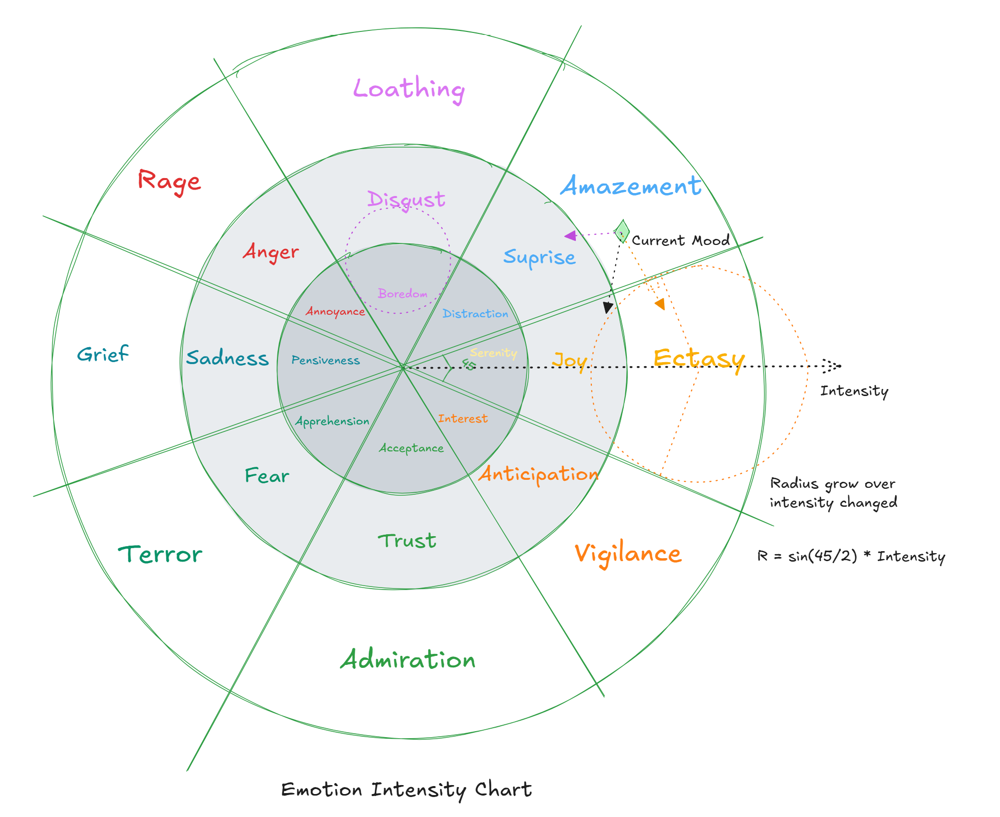
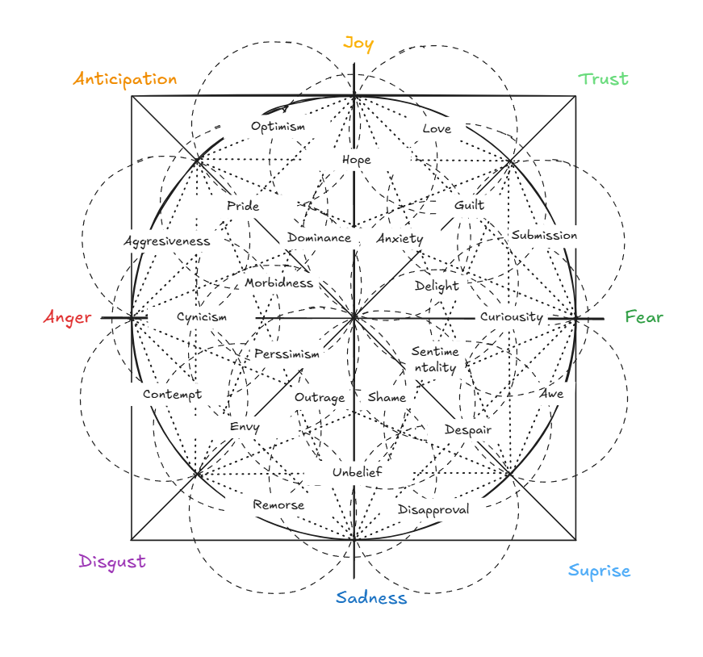

# AI emotion system that is data driven.

## Design
- An EmotionComponent with current Valence-Arousal 2D coordinate (VACoordinate) and a radius. An array holding active emotions.
- An Emotion have intensity from 1 to 100, a decay rate, an influence radius and a VACoordinate. Intensity degrade over time with decay rate.
- An external stimulus ( dialogue , event, object ...) can trigger an emotion with intensity and add it to EmotionComponent make it active.
- An emotion can be a combination of 2 or more emotions  ( reference pluchik's wheel of emotion), this emotion can only be triggered if the required emotions are active.
- An emotion have sub emotion tag that activated when the intensity of the emotion reach a threshold.
- An emotion can link with another emotion's intensity with a mapping of how threhold of both intensities can trigger and new emotion tags. 
- An active emotion with intensity not zero pull the EmotionComponent's Current mood ( present as a  set of 2 coordinates) toward it with pull strength that stronger the further away the target V-A using linear spring model. One coordinate is in core emotion space and the other is in combined emotion space.

- A core emotion  map is a polar coordinate system with partitioned segments limit by angle and radius range that define the space of emotions called emotion zones.

    - 0-360 degrees partition by the emotions defined in EmotionLibrary.
    - There are 8 core emotions so it 360 / 8 = 45 degrees cone angle per emotion zone.
    - Core emotion zones get further partitioned by emotion range.
    - Emotion Range zone get further partitioned by variation emotions.
    - collect all the partitioned segments to form a hierarchy of emotion zones.

- A combined emotion space is a cartesian coordinate system with voronoi cells with each cell representing a unique combination of emotions.

- A dormant emotion is an emotion that is not active but can be triggered by a stimulus or gameplay tag event.

## Key Terms

- Core Emotion: A primary emotion that forms the basis of the emotional system.
- Emotion Zone: A region in the Valence-Arousal space that represents a specific emotion or emotional state.
- Emotion Range: A range of intensity values associated with a specific emotion.
- Variation Emotion: A sub-emotion that is activated when the intensity of a core emotion reaches a threshold.
- Link Emotion: A relationship between two emotions where the intensity of one emotion can trigger a variation emotion of another.
- Dormant Emotion: An emotion that is not active but can be triggered by a stimulus or gameplay tag event.
- Dominant Emotion: The primary emotion that is currently active in the emotional system with the strongest intensity.
- Active Emotions: A collection of emotions that are currently active in the emotional system with a non-zero intensity. 
- Current Mood: A 2D coordinates in the core emotion space that represents the current emotional state of the system. Usually stored in EmotionComponent.
- Valence-Arousal (VA) Space: A 2D space where emotions are mapped based on valence and arousal.
- Emotion Contexts: A map collection of emotion and the target of the emotion.

## Exposed API

### EmotionSubsystem

### EmotionLibrary

### EmotionComponent
Contain Mood, Emotion Contexts.

### EmotionContextObject

Emotion Context Object is a UObject cantain gameplaytag of a target as well as a collection of active emotions toward the target. It is registered to Emotion Subsystem on RegisterEmotionContext. It is used to track the emotional state directed toward a target. It get destroyed on UnregisterEmotionContext or all emotions toward the target are removed.

### Emotion Influencer

# CombinedEmotionMap
A map of combined emotions which each emotion represent a center point of an emotion zone expanded to a Voronoi cell.0

### CoreEmotionMap
Emotion wheel contain Emotions partitioned into Emotion Zones wedge in Hierarchy.
Visualization:
- Joy
    - Serenity
    - Joy
        - Joyful
        - Interested
        - Proud
        - Accepted
        - Powerful
        - Peaceful
        - Intimate
        - Optimistic
    - Estatic
        - Liberated
        - Ecstatic
        - Amused
        - Inquisitive
        - Important
        - Confidence
        - Courageous
        - Provocative
        - Fulfilled
        - Hopeful
        - Playful
        - Sensitive
        - Loving
        - Inspired
        - Open

### EmotionZone

### Emotion